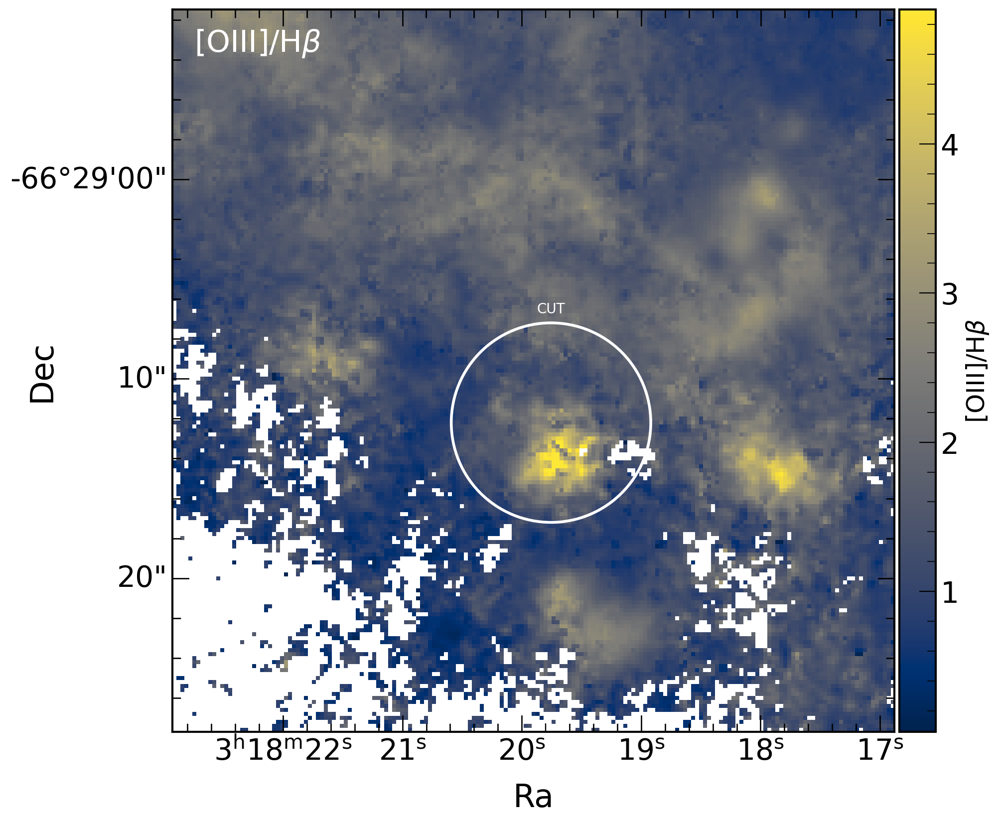

# muse_project

These scripts were developed for [Gúrpide et al. 2022](https://ui.adsabs.harvard.edu/abs/2022A%26A...666A.100G/abstract) and have been regularly updated since then. They allow to extract useful information mainly from MUSE datacubes and images but there's also some functionality to extract fluxes from hst images and chandra PSF profiles

## CHANDRA
marxsim_script.py --> Script to be run from the command line to simulate N PSFs based on a given chandra observation. Ciao and marx need to be properly setup before running the script. Use python marxsim_script.py -h to obtain the available command line arguments

check_extension.py --> Script to be run after marxsim_script.py has been run to analyse the output. Use python marxsim_script.py -h to obtain the available command line arguments

## HST
aperture_photometry.py --> Script to retrieve magnitudes, fluxes from a given ds9 region (it automatically reads the necessary keywords from the header to perform the corrections). A finite aperture correction is needed for small PSFs. Background subtraction is also possible (must be added a second line in the ds9 region file).

astro_corr.py --> Script to refine the astrometry of several HST images (more than one is possible, and the solution will be global to all of them) using the gaia catalogue. It uses tweakreg https://drizzlepac.readthedocs.io/en/latest/tweakreg.html.

## MUSE
----reddening----

deredden.py --> Script to deredden flux line maps, it needs as input the balmer decrement map (Halpha/Hbeta) and it will automatically localize the flux maps

deredden_momcheva.py --> Script to deredden flux line maps based on appendix of http://arxiv.org/abs/1207.5479, it needs as input the hbeta and halpha directories and it will automatically look for the line flux maps and deredden them (python deredden_momcheva.py -a halpha_path -b hbeta_path -Rv 4.05 -i 2.86). It creates a map of E(B-V) and one with the uncertainty on E(B-V)

----utils----

cutfromregion.py --> Script to cut images from an input region ds9 file.

python cutfromregion.py <image or cube .fits? -r <ds9 region for the cut> -o <outname> (otherwise autonamed as cut+image)

Before             |  After
:-------------------------:|:-------------------------:
  |  

image_stats.py --> Retrieve statistical information (min, max, mean) of a region or entire image by default
image_stats.py image.fits -region ds9reigonfile.reg

extract_radial_profiles.py images -n number_rectangles -r max_r (pixels) --offset <angle in deg> -w <width of the rectangles in pixels>

e.g. python extract_radial_profiles.py images -n 4 -r 70 --offset 10
Extraction regions             |  Radial averaged profiles
:-------------------------:|:-------------------------:
  |  


adjust_coordinates.py --> Runs a cross-correlation between an input reference image and the cube and estimates the offset needed to adjust the cube coordinates to the reference image (uses mpdaf estimate_coordinate_offset and adjust_coordinates)

python adjust_coordinates.py cube.fits --hst <ref image, typically HST>


----MAPPINGS-----

read_mappings.py --> Script to obtain predicted line ratios from the mapping libraries (python read_mappings.py <files> (for instance V_*_b0_001_s_lines.txt V_*b1_s_lines.txt [MVQP]_*b[0e]_s_lines.txt [MVQ]_*b10_s_lines.txt T_*b0_001_s_lines.txt T_*b1_s_* T_*b10_s_lines.txt). The script will read the paths to the BPT diagrams from bpt_config.py file

read_mappingsV.py --> Script to obtain predicted line ratios from the mapping V libraries. The script will read the paths to the BPT diagrams from bpt_config.py file

-------BPT-------
bpt_colored.py -> Classifies each pixel based on the IFU-improved BPT diagrams from Law+2021. Outputs fits and pngs of BPT diagrams, colored for better visualization

python bpt_colored.py --config config_file (see an example in config_files)

  |  

# Acknowledging

If these scripts were useful to you, we would greatly appreciate if you could cite the original paper for which these scripts were developed.
       
```
@article{2022A&A...666A.100G,
       author = {{G{\'u}rpide}, A. and {Parra}, M. and {Godet}, O. and {Contini}, T. and {Olive}, J. -F.},
        title = "{MUSE spectroscopy of the ULX NGC 1313 X-1: A shock-ionised bubble, an X-ray photoionised nebula, and two supernova remnants}",
      journal = {\aap},
     keywords = {instrumentation: spectrographs, stars: black holes, ISM: jets and outflows, stars: neutron, X-rays: binaries, accretion, accretion disks, Astrophysics - High Energy Astrophysical Phenomena},
         year = 2022,
        month = oct,
       volume = {666},
          eid = {A100},
        pages = {A100},
          doi = {10.1051/0004-6361/202142229},
archivePrefix = {arXiv},
       eprint = {2201.09333},
 primaryClass = {astro-ph.HE},
       adsurl = {https://ui.adsabs.harvard.edu/abs/2022A&A...666A.100G},
      adsnote = {Provided by the SAO/NASA Astrophysics Data System}
}
```

